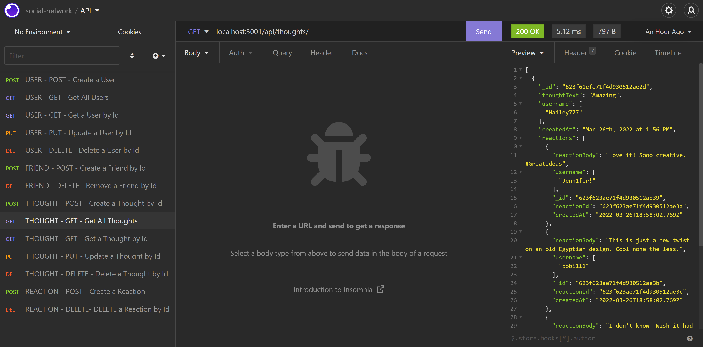

# [Social Network API Endpoints](#title)

## [Description](#description)
A CRUD API platform for a social network web application that allows users to create profiles, share their thoughts, create friends, and react to friend's thoughts. Solution is coded in Javascript and utilizes MongoDB (NoSQL) as its data store.

>> - Project Repository URL: https://github.com/bkfleet1/social-network
>> 

>> - Walkthrough Video: https://drive.google.com/file/d/1Ecr3Ijb72dkBl6dAJGlbvhACsXjAhrXX/view

## Table of Contents
> - [Title](#title)
> - [Description](#description)
> - [Developer](#developer)
> - [Resources](#resources)
> - [Installation](#installation)
> - [Use Instructions](#usage)
> - [Tests](#tests)
> - [Questions](#questions)

## [Developer](#developer)
[Brad Kelley](mailto:bradkelleytech@gmail.com)

## [Resources](#resources)

The following resources were used in the development of this project.
> - Express (version 4.17.3)
> - MongoDB (version 5.0.6)
> - Mongoose (version 6.2.8)
> - Node.js (version 16.14.2)

## [Installation](#installation)

NOTE: This application requires Node.js (version ^16.14.2) and MongoDB (version ^5.0.6). The installation instructions below do not describe how to install Node.js and MongoDB. Additionally, the instruction assume that you have successfully installed both applications prior to installing **Social Network**. You can download the latest versions of these Node.js and MongoDB from the following URLs:

> * [Node.js](https://nodejs.org/en/) - https://nodejs.org/en/

> * [MongoDB](https://www.mongodb.com/try/download/community) - https://www.mongodb.com/try/download/community

The following steps are required to execute the **Social Network** application.
> 1. Clone the repository located at: https://github.com/bkfleet1/social-network.
> 2. Open the project in a terminal application, such as git bash, and install NPM. To install **NPM**, **Express**, and **Mongoose** dependencies, simply type **npm install** and press enter. 

## [Use Instructions](#usage)
After the installation process, you are ready start the application server powered by Express. Just open the project in a terminal application, such as git bash, and type "**npm start**" and press enter. Your initialized application server should resemble the image below.

The application will create the **Social Network** database in MongoDB, which includes two collections: **users** and **thoughts**. The image below illustrates the the application's database running in MongoDB.

### USER - (POST) Create User
>> - To create a new user in the application's **user** table, you can use a **POST** api call to **http://{your url}/api/users/**. The image below illustrates this feature.

>>  .

### USER - (GET) Get All Users
>> - To view all users in the application's **user** collection, you can use a **GET** api call to **http://{your url}/api/users/**. The image below illustrates this feature.

>>  .

### USER - (GET) Get a User
>> - To view a single user by their **_id** (userId) in the application's **user** collection, you can use a **GET** api call to **http://{your url}/api/users/{user:_id}**. The image below illustrates this feature.

>>  .

### USER - (PUT) Update a User
>> - To update a single user by their **_id** (userId) in the application's **user** collection, you can use a **PUT** api call to **http://{your url}/api/users/{user:_id}**. The image below illustrates this feature.

>>  .

### USER - (DELETE) Delete a User
>> - To delete a single user by their **_id** (userId) in the application's **user** collection, you can use a **DELETE** api call to **http://{your url}/api/users/{user:_id}**. The image below illustrates this feature.

>>  .

### FRIEND - (POST) Create Friend
>> - To create a new friend  by their **_id** (userId) in the application's **user** collection, you can use a **POST** api call to **http://{your url}/api/users/{user:_id}/friends/{friend user:_id}**. The image below illustrates this feature.

>>  .

### FRIEND - (DELETE) Delete Friend
>> - To delete a friend by their **_id** (userId) in the application's **user** collection, you can use a **DELETE** api call to **http://{your url}/api/users/{user:_id}/friends/{friend user:_id}**. The image below illustrates this feature.

>>  .

### THOUGHT - (POST) Create Thought
>> - To create a new thought in the application's **thought** collection, you can use a **POST** api call to **http://{your url}/api/thoughts/**. The image below illustrates this feature.

>>  .

### THOUGHT - (GET) Get All Thoughts
>> - To view all users in the application's **thought** collection, you can use a **GET** api call to **http://{your url}/api/thoughts/**. The image below illustrates this feature.

>>  .

### THOUGHT - (GET) Get a Thought
>> - To view a single thought by its **_id** (thoughtId) in the application's **thought** collection, you can use a **GET** api call to **http://{your url}/api/thoughts/{thought:_id}**. The image below illustrates this feature.
>>  .

### THOUGHT - (PUT) Update a Thought
>> - To update a single thought by its **_id** (thoughtId) in the application's **thought** collection, you can use a **PUT** api call to **http://{your url}/api/thoughts/{thought:_id}**. The image below illustrates this feature.

>>  .

### THOUGHT - (DELETE) Delete a Thought
>> - To delete a single thought by its **_id** (thoughtId) in the application's **thought** collection, you can use a **DELETE** api call to **http://{your url}/api/thoughts/{thought:_id}**. The image below illustrates this feature.

>>  .

### REACTIONS - (POST) Create Reaction
>> - To create a new reaction in the application's **thought** collection, you can use a **POST** api call to **http://{your url}/api/thoughts/{thought:_id}**. The image below illustrates this feature.

>>  .

### REACTIONS - (DELETE) Delete a  Reaction
>> - To delete a reaction in the application's **thought** collection, you can use a **DELETE** api call to **http://{your url}/api/thoughts/{thought:_id}**. The **reactionId** is required in the call's **body** in a JSON format. The image below illustrates this feature.

>>  .

## [Tests](#tests)
No formal testing is available. 

## [Questions](#questions)
Please email [Brad Kelley](mailto:bradkelleytech@gmail.com) with any project questions.
